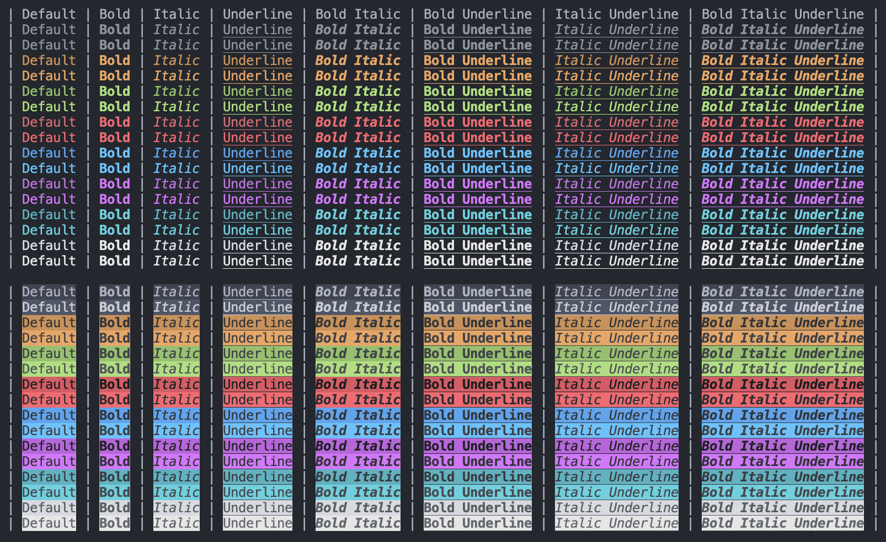
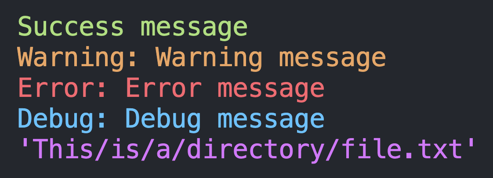

# ANSI colored output in C

A small library that facilitates the output of colored text in the terminal. 

---

It also contains specific functions to output directories, success, warning, error, and debug messages. 

    

